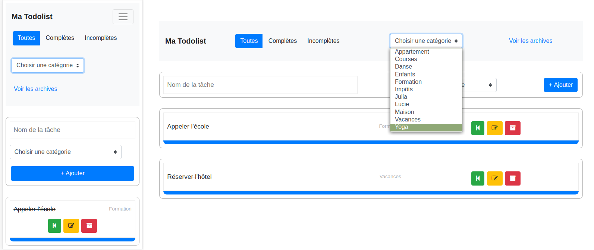
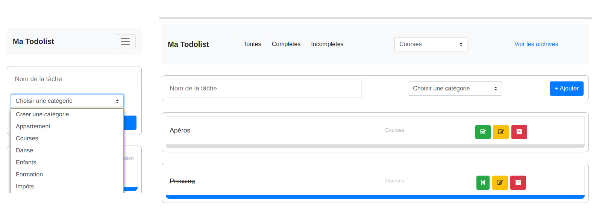
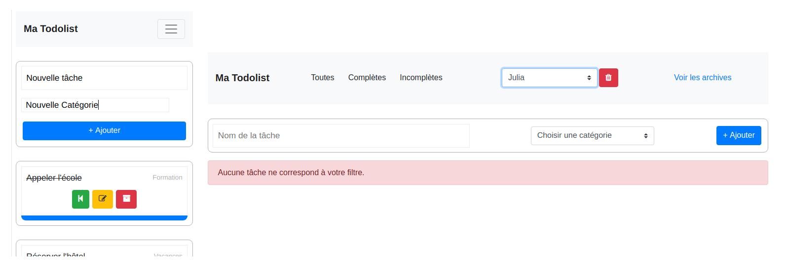

# My To-Do List

est une petite application permettant de ne plus rien oublier de ce que vous avez à faire.

Cette application a nécessité le développement d'une API avec Lumen pour le Back.

Pour le front, deux versions ont été développées : une en JavaScript, avec de l'ajax pour les requêtes au back, et une autre en React (avec Redux et l'utilisation de la librairie Axios pour les appels à l'API).

## Aperçu

Il est possible de filter les tâches selon les critéres définis dans la barre de navigation.

Il est possible de créer une catégorie. Ici, on voit également le résultat du filtre sur une catégorie. Chaque tâche peut changer changer de statuts (incompléte, compléte ou archivée), on peut également modifier le titre.

Enfin, il est possible d'ajouter une tâche et de créer une nouvelle catégorie si besoin. Il est également possible de supprimer une tâche archivée ou bien une catégorie qui ne retourne plus aucune tâche (y compris archivée).

